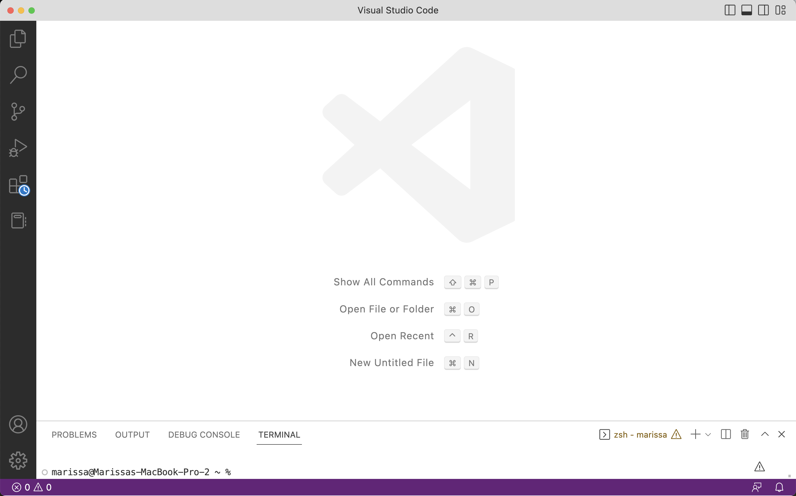
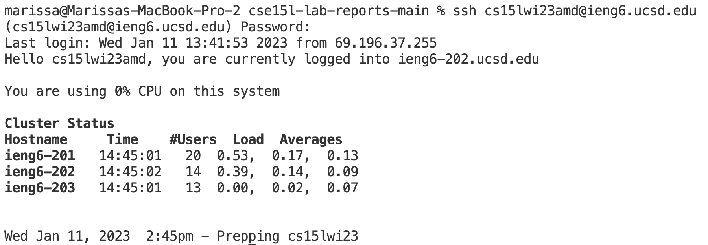
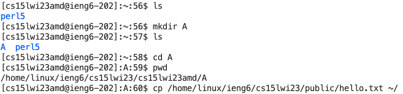

# Week 1 Lab Report

## Set Up Account
First, I looked up my [account](https://sdacs.ucsd.edu/~icc/index.php) and followed this [tutorial](https://docs.google.com/document/d/1hs7CyQeh-MdUfM9uv99i8tqfneos6Y8bDU0uhn1wqho/edit) to reset my course-specific password. 

## Install VScode
I skipped this step since I already had [VScode](https://code.visualstudio.com/) installed. If you don't, install VScode onto your specific operating system. For me, opening VScode looked like this.

## Remotely Connecting
Next, I opened a new terminal in VScode by clicking on Terminal then New Terminal. I entered this ssh command into the terminal.
`$ ssh cs15lwi23amd@ieng6.ucsd.edu`
I typed and hit enter when a prompt about the authenticy of host showed up, then entered my newly created password. After that, I was connected to the server!

## Commands
I then experimented with some common commands by typing them into the Terminal. I made a new directory on the server using `mkdir` and confirmed its existence by listing all the files with `ls`. Then I  went into my new directory with `cd` and checked out the new filepath using `pwd`. Finally, I copied over the hello.txt file into the A directory with `cp`.

I exited the terminal with `exit`
