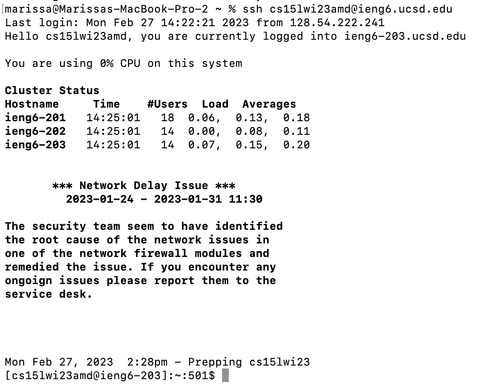
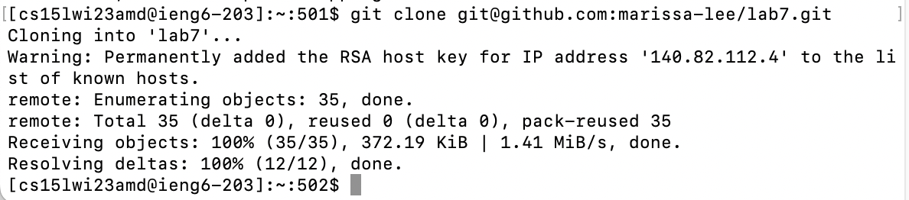
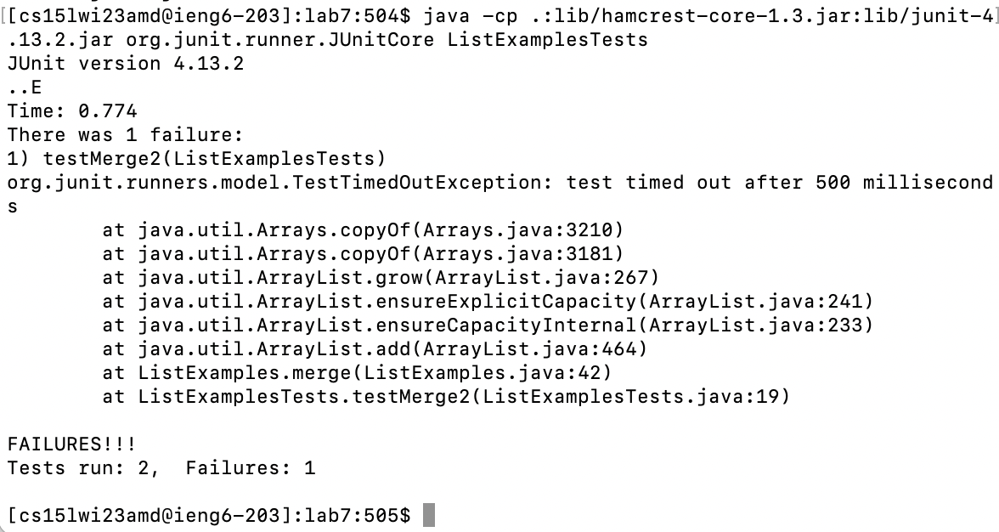
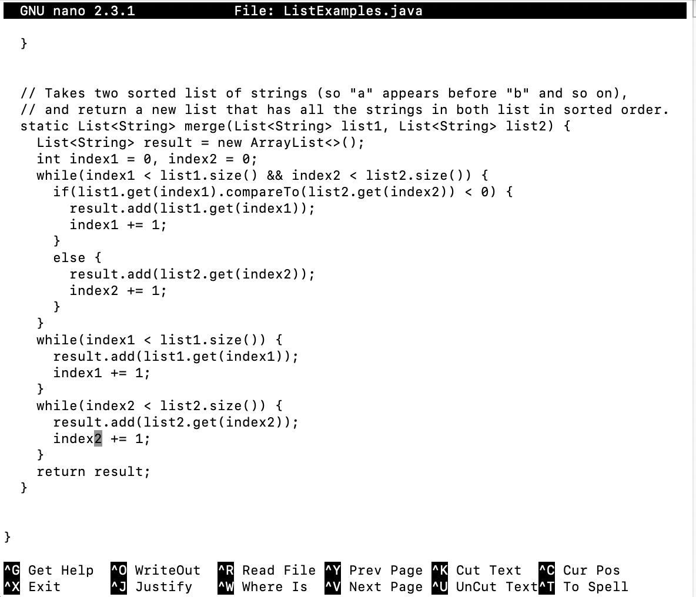
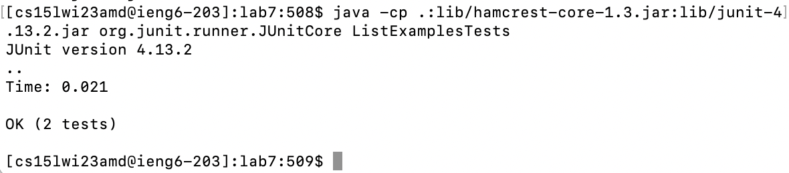
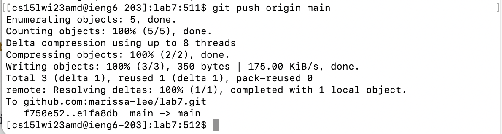

# Lab Report 4

**Log into ieng6**

Keys: `<ctrl> r ssh <enter>`

I used `<ctrl> r` to access reverse i search and typing `ssh` accessed the `ssh cs15lwi23amd@ieng6.ucsd.edu` command.

**Clone your fork of the repository from your Github account**

Keys: `git clone git@github.com:marissa-lee/lab7.git <enter>`

I cloned a fork of the repository with the `git clone` command.

**Run the tests, demonstrating that they fail**

Keys: `cd l <tab> <enter>, <ctrl> r javac <enter>, `<ctrl> r java <space> <enter>

After `cd`, I tabbed after `l` so that the path to the repository directory `lab7` is autocompleted. Then I used `<ctrl> r` to search for the command to compile all files: `javac -cp .:lib/hamcrest-core-1.3.jar:lib/junit-4.13.2.jar *.java`. Then I used `<ctrl> r` again to search for the command `java -cp .:lib/hamcrest-core-1.3.jar:lib/junit-4.13.2.jar org.junit.runner.JUnitCore ListExamplesTest` to run the `ListExamplesTest` file. 

**Edit the code file to fix the failing test**

Keys: `nano L <tab> .j <tab> <enter>, <ctrl> w index1 += 1; <enter> <esc> w <esc> w <right> <right> <right> <right> <right> <right> <delete> 2, <ctrl> x, y, <enter>`

I used `tab` twice to open ListExamples.java with the nano editor. The first `tab` filled out `ListExamples` and the second `tab` filled out `ListExamples.java`. Then I used `<ctrl> w` to search for the line with `index1 += 1` in nano. Since there were three instances of this search result, I used `<esc> w` twice to get to the third instance of this line. I used the right arrows so my cursor was right before 1. Then I deleted the 1 and typed in 2 to edit the code. I exited nano with `<ctrl> x` and saved with `y`.

**Run the tests, demonstrating that they now succeed**

Keys: `<up> <up> <up> <enter>, <up> <up> <up> <enter>`

I used `<up>` to access `javac -cp .:lib/hamcrest-core-1.3.jar:lib/junit-4.13.2.jar *.java` which was 3 up in my search history. I then used `<up>` to access `java -cp .:lib/hamcrest-core-1.3.jar:lib/junit-4.13.2.jar org.junit.runner.JUnitCore ListExamplesTest` which was 3 up in my search history.

**Commit and push the resulting change to your Github account**

Keys: `git add L <tab> .j <tab> <enter>, git commit -m "fix fail" <enter>, git push origin main`

I used `<tab>` twice to add ListExamples.java as a file to commit with `git add`. The first `tab` filled out `ListExamples` and the second `tab` filled out `ListExamples.java`. Then I used `git commit -m` to commit my changes with the given message. Then I used `git push origin main` to push my changes to my Github account.