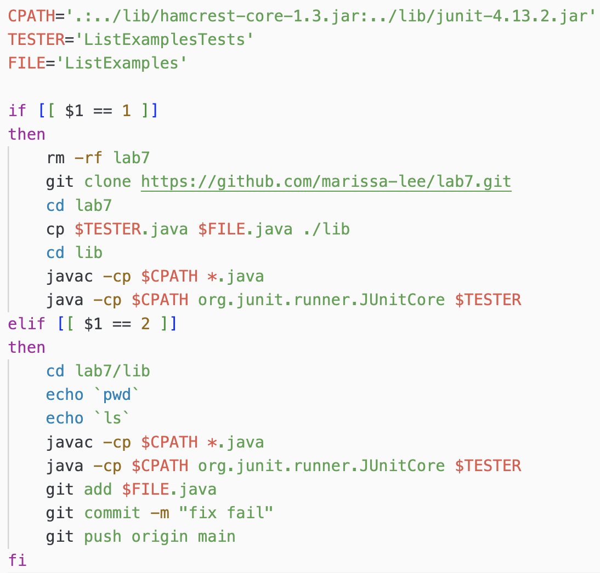
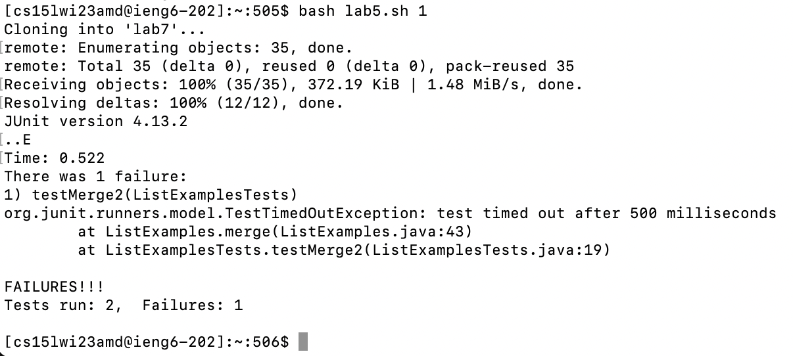
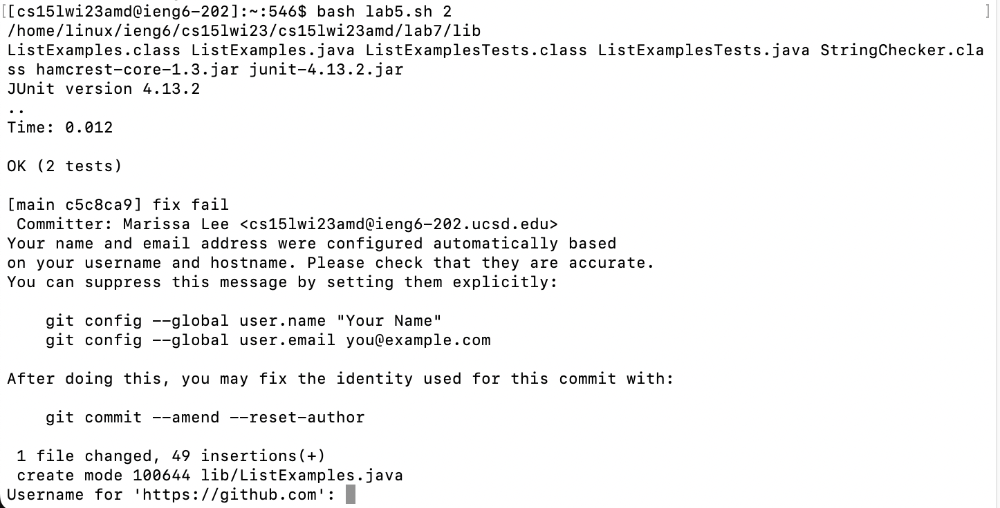

# Lab Report 5

Doing lab report 4 quickly using a bash script. 

Logging into the server was the same since the bash script is located in the server. 

I ran the bash script with the argument 1. This automated the process of cloning my fork of the repository and running the tests in ListExamples.test.

I manually fixed the bug using nano like before.

Then I ran the bash script with the argument 2. This ran the tests again, showed that they succeeded, and commit and push the edited files onto Github.
